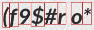
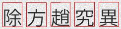
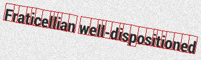
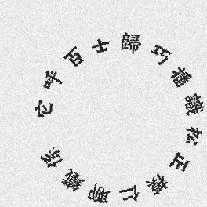
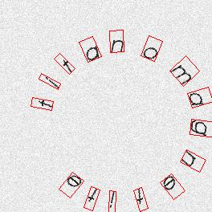

## TextRecognitionDataGenerator 

#### Forked from [Belval/TextRecognitionDataGenerator](https://github.com/Belval/TextRecognitionDataGenerator)

A synthetic data generator for text recognition

Generating text image samples to train an OCR software. Now supporting non-latin text! For a more thorough tutorial see [the official documentation](https://textrecognitiondatagenerator.readthedocs.io/en/latest/index.html).

## New
- Add bounding_box : (handwritten and distortion does not supported now)

  - Add `--bounding_box` argument to write each character's bounding box [left_top_x, left_top_y , right_top_x, right_top_y, right_bottom_x, right_bottom_y, left_bottom_x, left_bottom_y] into a .txt file ;

  - Add `--draw_bbox` argument to draw each character's bounding box on the image 

    

    

    

    

- Add Curved text generator,
  - you can define `-or 2` or `--orientation 2` to generate curved text

  - Add `--radius` argument to define the curved text radius 

  - support the use of `-cs `  to define the character space  
  
    
    
    
    
    

## Feature request & issues

If anything is missing, unclear, or simply not working, open an issue on the repository.

## What is left to do?

- multiple text generation
